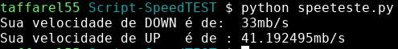

# Script-SpeedTEST


O seguinte script calcula a velocidade da conexão de internet.

### Exemplo

Abaixo temos um exemplo do uso do script:




### Requisitos:

Para usar o script, é necessário a instalação via pip do pacote `speedtest-cli` através do comando abaixo:

```bash
pip install speedtest-cli
```

 
